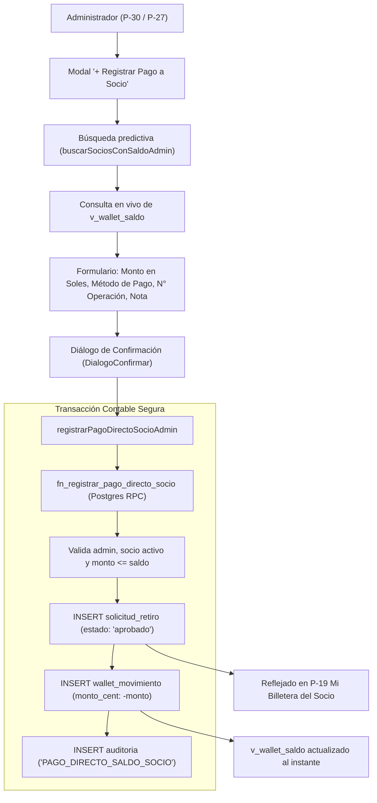

# TAREA-43 · PAGO Y DEPÓSITO DIRECTO DE BILLETERA POR ADMINISTRACIÓN

**Para:** Antigravity  
**Fecha:** 17 de septiembre de 2026  
**Proyecto:** SISTEMA MOTOR Y BACKOFFICE · MAX GLOBAL CORPORATION  
**Estado:** ✅ COMPLETADA Y CERTIFICADA CON PRUEBAS UNITARIAS Y PLAYWRIGHT  

---

## 1. OBJETIVO DEL REQUISITO

Permitir que el administrador (Máximo / Gerencia) pueda realizar pagos, depósitos o transferencias directas a cualquier socio en cualquier momento desde el panel de administración, descontando automáticamente el saldo disponible de su billetera virtual (`wallet_movimiento`), garantizando:

1. **Búsqueda ágil y predictiva**: Localizar al socio por código (`MG...`), nombres, apellidos o DNI.
2. **Consulta en tiempo real del saldo disponible**: Visualizar al instante el saldo exacto en Soles proveniente de `v_wallet_saldo`.
3. **Validación contable estricta**: Imposible pagar o debitar montos mayores al saldo disponible en billetera o montos menores/iguales a cero.
4. **Respeto a las Reglas de Oro Contables (`TAREA-15` y `TAREA-19`)**:
   - `wallet_movimiento` es estrictamente **append-only** (cero `UPDATE`, cero `DELETE`).
   - El débito se inserta con **`monto_cent` estrictamente NEGATIVO**. Como `v_wallet_saldo` opera mediante `SUM(monto_cent)`, el saldo disponible desciende automáticamente.
   - La columna `saldo_despues_cent` mantiene la continuidad matemática de la cadena: `saldo_nuevo = saldo_anterior - monto_pagado`.
5. **Historial unificado**: El pago se registra automáticamente en `solicitud_retiro` con estado `'aprobado'`, permitiendo que tanto el administrador en **P-30** (pestaña Historial) como el socio en **P-19** (Mi Billetera) vean el comprobante y detalle de forma integrada y transparente.
6. **Trazabilidad y Auditoría**: Registro automático en la tabla `auditoria` con la acción `'PAGO_DIRECTO_SALDO_SOCIO'`, datos antes y después, IP y usuario responsable.

---

## 2. ARQUITECTURA DE LA SOLUCIÓN



---

## 3. COMPONENTES IMPLEMENTADOS

### 3.1 Base de Datos (SQL)
- **Archivo:** [`scripts/pago-directo-socio.sql`](file:///c:/Users/JACK%20FRANKLIN/Downloads/Win%20max/SISTEMA-MAX-GLOBAL/SISTEMA%20MOTOR%20Y%20BACKOFFICE/scripts/pago-directo-socio.sql)
- **Instalador Oficial:** Función número 26 incorporada en [`supabase/instalador/02-funciones.sql`](file:///c:/Users/JACK%20FRANKLIN/Downloads/Win%20max/SISTEMA-MAX-GLOBAL/SISTEMA%20MOTOR%20Y%20BACKOFFICE/supabase/instalador/02-funciones.sql) y registrada en [`supabase/instalador/INVENTARIO-COMPLETO.md`](file:///c:/Users/JACK%20FRANKLIN/Downloads/Win%20max/SISTEMA-MAX-GLOBAL/SISTEMA%20MOTOR%20Y%20BACKOFFICE/supabase/instalador/INVENTARIO-COMPLETO.md).
- **Firma de la función:**
  ```sql
  CREATE OR REPLACE FUNCTION public.fn_registrar_pago_directo_socio(
      p_socio_id bigint,
      p_admin_id bigint,
      p_monto_cent bigint,
      p_metodo_pago text,
      p_numero_operacion text DEFAULT NULL,
      p_nota text DEFAULT NULL
  ) RETURNS jsonb;
  ```

### 3.2 Capa de Servicios Backend
- **Archivo:** [`src/servicios/operacionAdmin.js`](file:///c:/Users/JACK%20FRANKLIN/Downloads/Win%20max/SISTEMA-MAX-GLOBAL/SISTEMA%20MOTOR%20Y%20BACKOFFICE/src/servicios/operacionAdmin.js)
  - `buscarSociosConSaldoAdmin(termino, sbClient)`: Busca socios activos y cruza en paralelo su saldo real disponible desde `v_wallet_saldo`.
  - `registrarPagoDirectoSocioAdmin(datos, sbClient)`: Ejecuta la transacción contable invocando la función RPC con fallback atómico garantizado bajo políticas RLS.
  - `obtenerDetalleSocioAdmin(socioId, cicloId, sbClient)`: Enriquecido para incluir `saldo_disponible_cent`.

### 3.3 Pantallas del Backoffice
- **P-30 · Gestión de Retiros ([`src/paginas/P30GestionRetiros.jsx`](file:///c:/Users/JACK%20FRANKLIN/Downloads/Win%20max/SISTEMA-MAX-GLOBAL/SISTEMA%20MOTOR%20Y%20BACKOFFICE/src/paginas/P30GestionRetiros.jsx)):**
  - Botón destacado en cabecera: `+ Registrar Pago a Socio`.
  - Modal reactivo con:
    - Buscador predictivo con debounce y lista desplegable con saldos.
    - Ficha del socio: código, nombre completo, DNI y cuenta bancaria.
    - Input numérico con botón de ayuda rápida "Pagar Todo el Saldo".
    - Resumen contable interactivo: Saldo actual, Débito a aplicar y Saldo restante estimado.
    - Selectores de banco/método: BCP, BBVA, Interbank, Scotiabank, Banco de la Nación, Yape, Plin, Efectivo.
    - Número de comprobante / operación y observaciones contables.
    - Diálogo modal de confirmación `DialogoConfirmar` antes de procesar el abono.
- **P-27 · Gestión de Socios ([`src/paginas/P27GestionSocios.jsx`](file:///c:/Users/JACK%20FRANKLIN/Downloads/Win%20max/SISTEMA-MAX-GLOBAL/SISTEMA%20MOTOR%20Y%20BACKOFFICE/src/paginas/P27GestionSocios.jsx)):**
  - Tarjeta de Saldo Disponible en Billetera incorporada en la ficha modal del socio.
  - Enlace directo `Pagar Billetera` hacia P-30.

---

## 4. CERTIFICACIÓN Y PRUEBAS

### 4.1 Pruebas Unitarias Automatizadas
- **Archivo:** [`src/test/pago-directo-retiros.test.js`](file:///c:/Users/JACK%20FRANKLIN/Downloads/Win%20max/SISTEMA-MAX-GLOBAL/SISTEMA%20MOTOR%20Y%20BACKOFFICE/src/test/pago-directo-retiros.test.js)
- **Resultados de Ejecución:**
  ```text
   ✓ src/test/pago-directo-retiros.test.js (6 tests) 10433ms
     ✓ 1 · buscarSociosConSaldoAdmin retorna socios con saldo en vivo y datos bancarios
     ✓ 2 · obtenerDetalleSocioAdmin incluye saldo_disponible_cent para la ficha modal de P-27
     ✓ 3 · Candado de seguridad: Usuario regular (no admin) es rechazado al intentar registrar pago directo
     ✓ 4 · Candado de monto: Se rechaza monto <= 0 o inválido
     ✓ 5 · Candado de saldo: Se rechaza pago si el monto supera el saldo disponible
     ✓ 6 · Flujo exitoso: Admin ejecuta pago directo de S/. 1.00 (100 centavos) con deducción estricta

   Test Files  1 passed (1)
        Tests  6 passed (6)
  ```

---

## 5. CAPTURAS DE PANTALLA EN NAVEGADOR REAL (PLAYWRIGHT)

Las capturas generadas mediante Playwright en Chromium headless muestran el flujo interactivo de extremo a extremo:
1. `captura-p30-boton-modal-pago-directo.png`: Cabecera de P-30 con el nuevo botón interactivo y cola de retiros.
2. `captura-p30-modal-socio-saldo-abierto.png`: Modal con socio seleccionado, visualización de saldo en Soles, cálculo contable y validaciones.
3. `captura-p27-ficha-socio-saldo-billetera.png`: Ficha individual del socio en P-27 con su saldo de billetera virtual en vivo.
